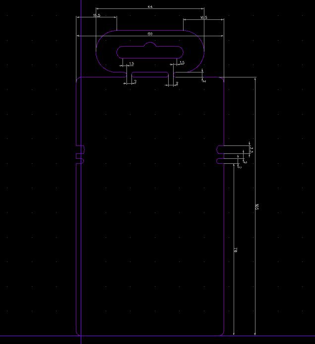
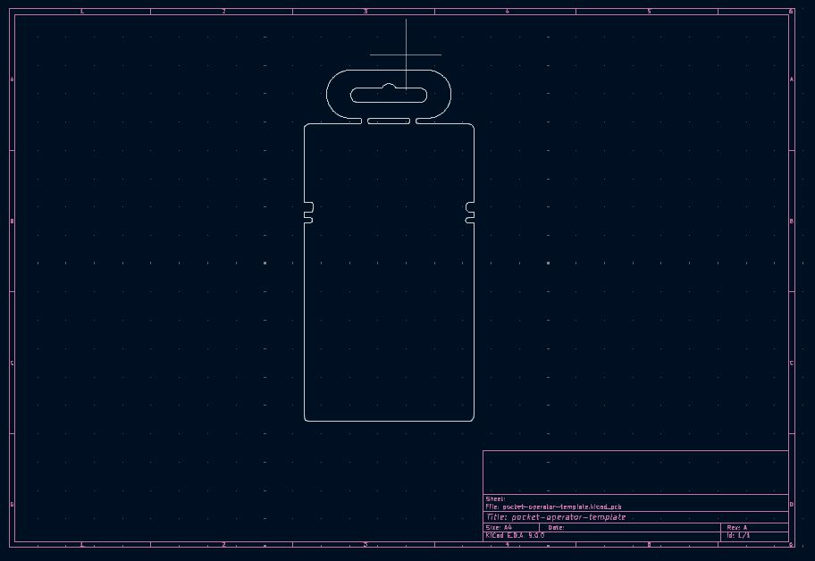
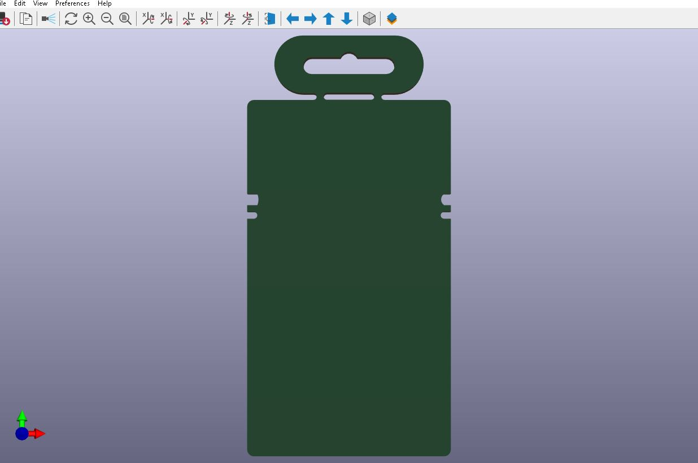

# pocket-operator-template
 board template that mimics teenage engineering's pocket operator form factor

## Board outline 

This project is a board outline in DXF format as well in projects for DipTrace and KiCad.  

## Directories

"diptrace-board" contains a board file (pocket-operator-template-v3.dip) that has the board outline. 

"kicad-board/pocket-operator-template/" contains a KiCad project with a board file that contains the board outline.

"dxf" contains DXF files with the board outline that can be used to be imported as board outline into your tool of choice. 

## License

Released under the Creative Commons Attribution 4.0 License
https://creativecommons.org/licenses/by/4.0/

